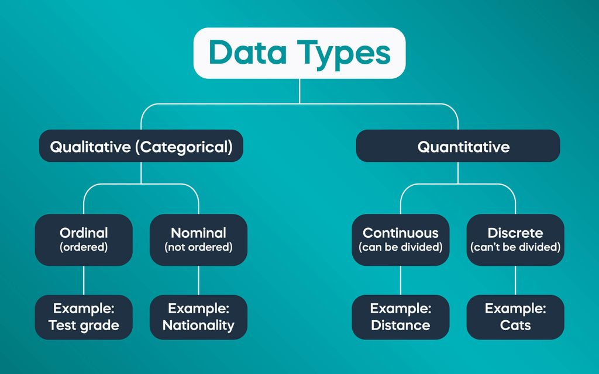

\newpage

\tableofcontents

\newpage

\listoftables

\newpage

\listoffigures

\newpage

# Introduction

Welcome to [Restaurant Name], where culinary excellence meets unparalleled hospitality. Nestled in the heart of [Location], our restaurant offers a sensory journey through exquisite flavors and impeccable service. From the moment you step through our doors, prepare to indulge in a gastronomic adventure crafted by our talented chefs, who passionately curate each dish with the finest ingredients and innovative techniques. Whether you're seeking an intimate dinner for two, a lively gathering with friends, or a memorable celebration, [Restaurant Name] promises an unforgettable dining experience that tantalizes the palate and delights the soul.

## Background

Welcome to [Restaurant Name], where culinary excellence meets unparalleled hospitality. Nestled in the heart of [Location], our restaurant offers a sensory journey through exquisite flavors and impeccable service. From the moment you step through our doors, prepare to indulge in a gastronomic adventure crafted by our talented chefs, who passionately curate each dish with the finest ingredients and innovative techniques. Whether you're seeking an intimate dinner for two, a lively gathering with friends, or a memorable celebration, [Restaurant Name] promises an unforgettable dining experience that tantalizes the palate and delights the soul.

## Objectives

1.  To calculate the of *customers*.
2.  To compare the tips between **male** and ***female***.

-   To calculate the tips of customers.

-   To compare the tips between male and female.

-   To calculate the tips of customers.

-   To compare the tips between male and female.

-   To calculate the salary of male and female

    -   To calculate

\newpage

**To Underline**

*for pdf* \text{\underline{This sentence is underlined}}

*For html* [underline this text]{style="text-decoration:underline"}

**Highlight Text**

\textcolor{blue}{high}

## Limitations

CO~2~

CO^2^

ruben^sharma^

~~Ruben~~

**For Links** I Take R class in broadways institute. For more study please visit [\textcolor{blue}{here}](https://broadwayinfosys.com/).

**For Picture from links source**[^1]

[^1]: Compiled

<!--  -->

\newpage



# Methodology

sampling[^2]

[^2]: Adjusted \newpage

## Study Area

\newpage

## Data Collection

\newpage

## Data Analysis

```{r loading data set, echo = FALSE, warning=FALSE, message = FALSE, comment=NA}
setwd("D:/R_projects/tips_analysis/")
dat <- read.table("Data/tips_text.txt", header = TRUE)
library(tidyverse)
tab <- dat %>%
  group_by(sex) %>%
  summarise(n = n(),
            mean = mean(tip),
            sd =sd(tip))
knitr::kable(tab, col.names = c("Gender", "Number of Samples","Average tips","Standard Deviation"),digits = 2, align = "c", caption = "The summary of tips given by male and female customers")

```

The table 1 describes that the average tips that female customer provide is `r round(mean(dat[dat$sex == "Female",2]),2)` dollar.

**Figures in**

```{r figure example,echo = FALSE, message = FALSE, warning=FALSE, fig.cap = "The relation of total bill and tips", fig.height=4, fig.width=4,fig.align='center',fig.dpi=300}
dat %>%
  ggplot(mapping = aes(x = total_bill, y = tip)) +
  geom_point(col = "red") +
  labs(x = "Total Bill",
       y = "Tips",
       caption = "Source:Kaggle.com") +
  theme_classic()
```

\newpage

# Result

\newpage

# Discussion

\newpage

# Conclusion and Recomendation

**Underline**

For pdf

\text{\underline{This sentence is underlined.}}

<u> This line is underlined </u>

**textcolor**

\textcolor{green}{The tree is green in color.}

## Equations

1.  Simple Mean Equation

The formula for mean $\overline{X}$ or $\overline{X}$is as follows:

$$ \overline{X}  = \frac{\sum_i^nx}{n}\tag{i}$$ where, $\overline{X}$ represents mean, $x$ is observation and $n$ is number of observation.

$$\int x^ndx = \frac{1}{n + 1} x^{n + 1}\tag{ii}$$

$$ \int sinh\space ax\space dx = \frac{1}{a}\space cosh\space ax \tag{iii} $$ $$r = \frac{\sum(x_i- \bar{x})(y_i - \bar{y})}{\sqrt{\sum(x_i-\bar{x})^2 \sum(y_i - \bar{y})^2}}$$

Where,

\$r = \$ Pearson Correlation Coefficient

\$x_i = \$ x Variable samples \$y_i = \$ y variable sample

The public health [@fiore2000]

# Bibliography
